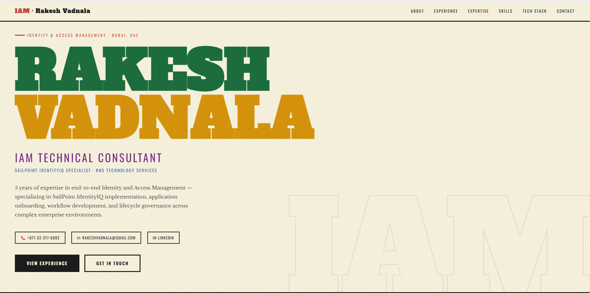

# 🔐 Rakesh Vadnala — IAM Portfolio Website

> Personal portfolio website for **Rakesh Vadnala**, IAM Technical Consultant specializing in SailPoint IdentityIQ — built with a bold editorial design inspired by *The Flow 2026* visual theme.

[](#)
[]()
[]()

---

## 📸 Preview



---

## ✨ Features

- **Bold editorial design** — chunky slab-serif typography (Alfa Slab One), cream/ivory background, and a vibrant 5-color palette (green, amber, purple, blue, dark-red)
- **Fully responsive** — adapts cleanly to mobile and desktop viewports
- **Animated skill bars** — scroll-triggered progress indicators for each technical skill
- **3D card tilt** — subtle perspective hover effect on expertise cards
- **Scroll-animated achievements** — staggered fade-up on entry
- **Zero dependencies** — pure HTML, CSS, and vanilla JavaScript; no frameworks, no build step
- **Noise texture overlay** — subtle grain for depth and tactility
- **Sticky navigation** — smooth-scroll links to all sections

---

## 🗂 Sections

| Section | Description |
|---|---|
| **Hero** | Name, title, contact chips, CTA buttons, decorative ghost text |
| **About** | Profile summary, key highlights, stats grid |
| **Experience** | Timeline of all roles with dates, responsibilities, and skill tags |
| **Expertise** | 6 hover-fill cards covering core IAM competencies |
| **Skills** | 8 scroll-triggered animated proficiency bars |
| **Tech Stack** | Grouped technology badges across 6 categories |
| **Achievements** | 4 noteworthy credits with bold numbering |
| **Contact** | Links to email, LinkedIn, and phone |

---

## 🚀 Getting Started

No build tools required. Just clone and open.

```bash
# Clone the repository
git clone https://github.com/rakeshvadnala/me.git

# Navigate into the folder
cd me

# Open in your browser
open index.html
```

Or simply drag `index.html` into any modern browser.

---

## 🛠 Tech Stack

- **HTML5** — semantic, accessible markup
- **CSS3** — custom properties, grid, flexbox, keyframe animations, IntersectionObserver-triggered transitions
- **Vanilla JavaScript** — scroll observers, 3D tilt effect, skill bar animation triggers
- **Google Fonts** — Alfa Slab One · Oswald · Libre Baskerville

---

## 🎨 Design System

| Token | Value | Usage |
|---|---|---|
| `--cream` | `#f5f0dc` | Page background |
| `--dark` | `#1a1a1a` | Text, borders |
| `--green` | `#1a6b3c` | Hero name line 1, SailPoint card |
| `--amber` | `#d4920a` | Hero name line 2, stat accents |
| `--purple` | `#7b2d8b` | Role title, Governance card |
| `--blue` | `#2563a8` | Sub-title, Tech Stack heading |
| `--red` | `#c0392b` | Section labels, nav accents |
| `--dark-red` | `#8b1a1a` | Contact section, Skills heading |

**Fonts:**
- Display / Headings → `Alfa Slab One`
- Labels / Tags / Nav → `Oswald`
- Body / Descriptions → `Libre Baskerville`

---

## 📁 File Structure

```
portfolio/
├── index.html        # Single-file portfolio (all CSS & JS inline)
├── README.md         # This file
└── preview.png       # Screenshot for README (add your own)
```

> All styles and scripts are embedded in `index.html` — keeping the project dependency-free and trivially deployable.

---

## 🌐 Deployment

### GitHub Pages (recommended)

1. Push this repo to GitHub
2. Go to **Settings → Pages**
3. Set source to `main` branch, `/ (root)`
4. Your site will be live at `https://rakeshvadnala.github.io/me/`

### Netlify

1. Drag the project folder into [netlify.com/drop](https://netlify.com/drop)
2. Live instantly — no config needed

### Vercel

```bash
npx vercel --prod
```

---

## 📬 Contact

| Channel | Details |
|---|---|
| 📧 Email | [rakeshvadnala@gmail.com](mailto:rakeshvadnala@gmail.com) |
| 💼 LinkedIn | [linkedin.com/in/rakeshvadnala](https://www.linkedin.com/in/rakeshvadnala/) |
| 📍 Location | Dubai, United Arab Emirates |

---

## 📄 License

This project is open source under the [MIT License](LICENSE). Feel free to fork, adapt, and use as inspiration for your own portfolio.

---

<p align="center">
  Built with ❤️ by <strong>Rakesh Vadnala</strong> · IAM Technical Consultant · Dubai 🇦🇪
</p>
